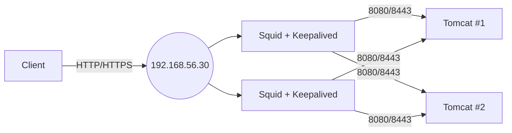

# Web-Cluster-Demo

# Build a Highly Available Web Cluster on Ubuntu with Squid Load Balancing, Tomcat Backends & Keepalived (HTTP + HTTPS)

A practical, copy‑paste guide to set up a small HA web cluster on Ubuntu. We’ll run two Tomcat backend servers, front them with Squid acting as a reverse‑proxy load balancer, and add Keepalived for failover using a floating Virtual IP (VIP). The result: HTTPS + HTTP, load‑balanced and highly available.

---

## What you’ll build

* **2× Tomcat app servers** (8080 HTTP, 8443 HTTPS)
* **2× Load balancer nodes** (Squid + Keepalived)
* **One Virtual IP (VIP)** that fails over automatically between LB nodes
* **Reverse proxying & load balancing** for both HTTP and HTTPS

> If you want to keep it minimal, you can run **Tomcat + Squid + Keepalived on the same two VMs**; the topology below shows the cleaner 4‑node version.

---

## Topology & IP Plan

| Role             | Hostname (suggested) | Host‑Only IP       |
| ---------------- | -------------------- | ------------------ |
| Tomcat #1        | `app1`               | `192.168.56.10/24` |
| Tomcat #2        | `app2`               | `192.168.56.20/24` |
| LB #1 (MASTER)   | `lb1`                | `192.168.56.11/24` |
| LB #2 (BACKUP)   | `lb2`                | `192.168.56.12/24` |
| VIP (Keepalived) | `vip`                | `192.168.56.30/24` |

**Network adapters per VM:**

* **NAT** (for internet / package installs)
* **Host‑Only** (cluster traffic + SSH + VIP)



---

## Prerequisites

* Ubuntu 22.04/24.04 VMs (works on recent Ubuntu)
* Basic terminal access (SSH)
* Two NICs (NAT + Host‑Only)

---

## Step 1 — Set Host‑Only static IPs (Netplan)

Find the Host‑Only interface name (often `enp0s8`):

```bash
ip -br a
```

Create (or edit) `/etc/netplan/01-hostonly.yaml` on each VM:

```yaml
network:
  version: 2
  renderer: networkd
  ethernets:
    enp0s8:
      addresses: [192.168.56.10/24]   # app1. Use .20 on app2, .11 on lb1, .12 on lb2
      nameservers:
        addresses: [1.1.1.1,8.8.8.8]
```

Apply:

```bash
sudo netplan apply
```

> Repeat on each VM with the correct address from the table.

---

## Step 2 — Install packages

Run on **all nodes** (Tomcat and LB):

```bash
sudo apt update
sudo apt install -y tomcat9 tomcat9-admin squid keepalived psmisc openssl ssl-cert
```

* `ssl-cert` installs a default self‑signed cert (useful for quick HTTPS testing)
* `psmisc` gives us `killall`, used by Keepalived health checks

---

## Step 3 — Configure Tomcat backends

We’ll enable HTTP (8080) and HTTPS (8443) and add a minimal page that shows which node served the request.

### 3.1 Create a tiny test page

**On app1:**

```bash
sudo tee /var/lib/tomcat9/webapps/ROOT/index.jsp >/dev/null <<'EOF'
<%@ page language="java" %>
<!DOCTYPE html>
<html><head><meta charset="utf-8"><title>WebCluster</title></head>
<body>
<h1>WebCluster: NODE-1 | Protocol: <%= request.getScheme() %></h1>
</body></html>
EOF
sudo chown tomcat:tomcat /var/lib/tomcat9/webapps/ROOT/index.jsp
```

**On app2**, do the same but change the heading to `NODE-2`.

### 3.2 Enable Tomcat HTTPS (8443)

Generate a keystore for Tomcat on **each app node**:

```bash
sudo keytool -genkeypair -alias tomcat -keyalg RSA -keysize 2048 \
  -keystore /etc/tomcat9/keystore.jks -storepass changeit -keypass changeit \
  -dname "CN=$(hostname -I | awk '{print $1}'), OU=IT, O=WebCluster, C=LK"

sudo chown tomcat:tomcat /etc/tomcat9/keystore.jks
sudo chmod 640 /etc/tomcat9/keystore.jks
```

Edit `/etc/tomcat9/server.xml` and **uncomment/configure** the HTTPS connector:

```xml
<Connector port="8443" protocol="org.apache.coyote.http11.Http11NioProtocol"
           maxThreads="150" SSLEnabled="true">
    <SSLHostConfig>
        <Certificate certificateKeystoreFile="/etc/tomcat9/keystore.jks"
                     certificateKeystorePassword="changeit"
                     type="RSA" />
    </SSLHostConfig>
</Connector>
```

Restart and enable Tomcat:

```bash
sudo systemctl restart tomcat9
sudo systemctl enable tomcat9
```

Quick tests on each app node:

```bash
curl -I http://localhost:8080/
curl -kI https://localhost:8443/
```

> `-k` ignores self‑signed cert warnings.

---

## Step 4 — Prepare Squid for HTTPS

Squid reads the default private key via the `ssl-cert` group.

```bash
# Let Squid (user "proxy") read the snakeoil private key
sudo usermod -aG ssl-cert proxy
sudo systemctl restart squid
```

---

## Step 5 — Configure Squid (reverse proxy + load balancing)

Edit `/etc/squid/squid.conf` on **lb1** and **lb2** (identical configs):

```conf
# === ACLs ===
acl all src all
acl backend dst 192.168.56.10 192.168.56.20
acl redir proto HTTP
http_access allow all

# === Backends: HTTP (8080) ===
cache_peer 192.168.56.10 parent 8080 0 no-query no-digest originserver \
 login=PASS sourcehash name=backend1
cache_peer_access backend1 allow backend redir

cache_peer 192.168.56.20 parent 8080 0 no-query no-digest originserver \
 login=PASS sourcehash name=backend2
cache_peer_access backend2 allow backend redir

# === Backends: HTTPS (8443) ===
cache_peer 192.168.56.10 parent 8443 0 no-query no-digest originserver \
 ssl sslflags=DONT_VERIFY_PEER login=PASS sourcehash name=backend1_ssl
cache_peer_access backend1_ssl allow backend !redir

cache_peer 192.168.56.20 parent 8443 0 no-query no-digest originserver \
 ssl sslflags=DONT_VERIFY_PEER login=PASS sourcehash name=backend2_ssl
cache_peer_access backend2_ssl allow backend !redir

# Force going via peers (never talk directly to origins)
never_direct allow all

# Disable caching for simplicity in demos
cache deny all
memory_pools off

# === Front-facing ports ===
# Default site helps Squid choose a Host header for acceleration
http_port 80 accel defaultsite=192.168.56.30
# IMPORTANT: keep on a single line
https_port 443 accel cert=/etc/ssl/certs/ssl-cert-snakeoil.pem key=/etc/ssl/private/ssl-cert-snakeoil.key defaultsite=192.168.56.30
```

Validate & restart:

```bash
sudo squid -k parse
sudo systemctl restart squid
sudo systemctl enable squid
```

> **Why these options?** `originserver` treats backends as origin servers, `sourcehash` spreads requests per‑client, `never_direct` avoids bypassing peers, and we explicitly disable caching for predictable behavior during labs.

---

## Step 6 — Keepalived (VRRP failover for VIP)

Find your Host‑Only interface name (likely `enp0s8`).

### 6.1 MASTER (`lb1`) — `/etc/keepalived/keepalived.conf`

```conf
vrrp_script chk_squid {
    script "/usr/bin/killall -0 squid"
    interval 5
    fall 4
    rise 1
}

vrrp_instance VI_1 {
    interface enp0s8
    state MASTER
    virtual_router_id 51
    priority 150
    advert_int 1
    authentication {
        auth_type PASS
        auth_pass mypassword
    }
    virtual_ipaddress {
        192.168.56.30/24
    }
    track_script {
        chk_squid
    }
}
```

### 6.2 BACKUP (`lb2`) — `/etc/keepalived/keepalived.conf`

```conf
vrrp_script chk_squid {
    script "/usr/bin/killall -0 squid"
    interval 5
    fall 4
    rise 1
}

vrrp_instance VI_1 {
    interface enp0s8
    state BACKUP
    virtual_router_id 51
    priority 100
    advert_int 1
    authentication {
        auth_type PASS
        auth_pass mypassword
    }
    virtual_ipaddress {
        192.168.56.30/24
    }
    track_script {
        chk_squid
    }
}
```

Enable & start on both LBs:

```bash
sudo systemctl enable keepalived
sudo systemctl restart keepalived
```

> The VIP `192.168.56.30` should appear on `lb1` (MASTER). If Squid dies or `lb1` goes down, `lb2` will take over.

---

## Step 7 — (Optional) UFW firewall rules (LBs)

```bash
sudo ufw allow 22/tcp
sudo ufw allow 80/tcp
sudo ufw allow 443/tcp
sudo ufw enable
```

---

## Step 8 — End‑to‑end testing

From your host or any client on the Host‑Only network:

```bash
# VIP responds over HTTP & HTTPS
curl -I http://192.168.56.30/
curl -kI https://192.168.56.30/

# Hit it multiple times — you should see NODE-1 and NODE-2 in the body alternating
```

**Failover test:**

```bash
# On lb1 (MASTER):
sudo systemctl stop squid
# On lb2, watch the VIP appear on enp0s8 within a few seconds
ip -br a | grep 192.168.56.30

# Bring lb1 back:
sudo systemctl start squid
```

**Logs to confirm:**

```bash
# Squid access log (LBs)
sudo tail -f /var/log/squid/access.log

# Tomcat logs (apps)
sudo journalctl -u tomcat9 -e

# Keepalived logs (LBs)
sudo journalctl -u keepalived -e
```

---

## Troubleshooting cheatsheet

```bash
# See interfaces & VIP
ip -br a

# Open ports & listeners
sudo ss -tupln

# Squid syntax check
sudo squid -k parse

# Keepalived dry-run check
sudo keepalived -t

# VRRP packets (advanced)
sudo tcpdump -ni enp0s8 vrrp
```

**Common issues**

* VIP not moving: interface name mismatch in Keepalived (`enp0s8`), or priorities mis‑set
* HTTPS fails on Squid: `proxy` user lacks access to key → add to `ssl-cert` group
* Backend unreachable: wrong backend IPs or Tomcat not listening on 8080/8443
* Caching surprises: ensure `cache deny all` is present during testing

---

## Production hardening (quick pointers)

* Replace snakeoil cert with **Let’s Encrypt** on the LB (use a domain + HTTP/ALPN challenge)
* Tune Squid TLS (TLS 1.2+, modern ciphers) and add **HSTS** via app if desired
* Health checks: replace `killall -0 squid` with a small script that **curl checks** `http://127.0.0.1:80/` and returns proper exit codes
* Consider `haproxy` or `nginx` for advanced LB features; Squid remains fine for this exercise

---

## Appendix — Full configs (copy‑paste)

### `/etc/squid/squid.conf`

```conf
acl all src all
acl backend dst 192.168.56.10 192.168.56.20
acl redir proto HTTP
http_access allow all

cache_peer 192.168.56.10 parent 8080 0 no-query no-digest originserver login=PASS sourcehash name=backend1
cache_peer_access backend1 allow backend redir

cache_peer 192.168.56.20 parent 8080 0 no-query no-digest originserver login=PASS sourcehash name=backend2
cache_peer_access backend2 allow backend redir

cache_peer 192.168.56.10 parent 8443 0 no-query no-digest originserver ssl sslflags=DONT_VERIFY_PEER login=PASS sourcehash name=backend1_ssl
cache_peer_access backend1_ssl allow backend !redir

cache_peer 192.168.56.20 parent 8443 0 no-query no-digest originserver ssl sslflags=DONT_VERIFY_PEER login=PASS sourcehash name=backend2_ssl
cache_peer_access backend2_ssl allow backend !redir

never_direct allow all
cache deny all
memory_pools off

http_port 80 accel defaultsite=192.168.56.30
https_port 443 accel cert=/etc/ssl/certs/ssl-cert-snakeoil.pem key=/etc/ssl/private/ssl-cert-snakeoil.key defaultsite=192.168.56.30
```

### `/etc/keepalived/keepalived.conf` (MASTER `lb1`)

```conf
vrrp_script chk_squid {
    script "/usr/bin/killall -0 squid"
    interval 5
    fall 4
    rise 1
}

vrrp_instance VI_1 {
    interface enp0s8
    state MASTER
    virtual_router_id 51
    priority 150
    advert_int 1
    authentication {
        auth_type PASS
        auth_pass mypassword
    }
    virtual_ipaddress {
        192.168.56.30/24
    }
    track_script {
        chk_squid
    }
}
```

### `/etc/keepalived/keepalived.conf` (BACKUP `lb2`)

```conf
vrrp_script chk_squid {
    script "/usr/bin/killall -0 squid"
    interval 5
    fall 4
    rise 1
}

vrrp_instance VI_1 {
    interface enp0s8
    state BACKUP
    virtual_router_id 51
    priority 100
    advert_int 1
    authentication {
        auth_type PASS
        auth_pass mypassword
    }
    virtual_ipaddress {
        192.168.56.30/24
    }
    track_script {
        chk_squid
    }
}
```

---

## Wrap‑up

You now have a functional HA web cluster on Ubuntu with Squid load balancing to two Tomcat backends and Keepalived providing an automatic floating VIP. Extend it with real certificates, health‑check scripts, and monitoring, and you’ve got a solid foundation for resilient web services.

**Suggested slug:** `ubuntu-ha-web-cluster-squid-tomcat-keepalived`

**Tags:** ubuntu, linux, high-availability, keepalived, squid, tomcat, reverse-proxy, load‑balancing, vrrp

> 📸 Add screenshots where helpful: `ip -br a` showing VIP on MASTER/BACKUP, `curl` output alternating between NODE‑1/2, and Squid access logs proving load balancing.

